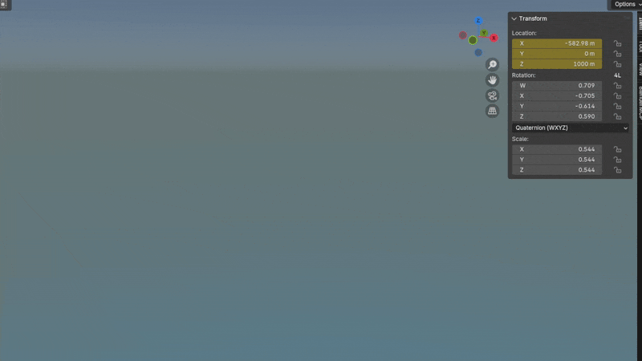
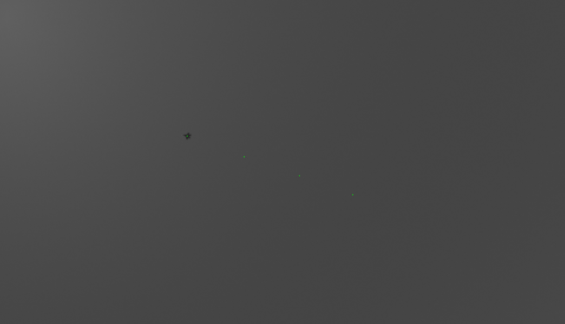

# Raydar

A C++ project for detecting and tracking objects in 3D space using multiple 2D cameras. The program outputs a list of 3D coordinates representing the tracked object's position over time.

## Demo

The demo below uses synthetic data generated in Blender. A plane flies through a 3D scene while multiple virtual cameras capture its movement. These camera frames are then fed into Raydar, which detects the object in each view and triangulates its position to compute 3D coordinates over time.

### Animation (Blender)


### Tracked Flight Path


## Quick Start

### Prerequisites

- C++ compiler (GCC/Clang)
- GNU Make
- wget or curl (for dependency installation)

## ⚠️ Cloning the Repository

### Large Files (Blender Scenes)

This project includes large `.blend` files (e.g., 3D scene with 5 cameras and a plane) which are tracked using [Git LFS (Large File Storage)](https://git-lfs.github.com/).

Before cloning the repository, make sure Git LFS is installed:

```bash
# One-time setup
git lfs install

# Clone the repository
git clone https://github.com/luisluis8414/raydar.git
```

If you've already cloned without LFS, run:

```bash
git lfs pull
```

**Note:** Blender backup files such as `.blend1` and `.blend@` are excluded via `.gitignore`. Only the primary `.blend` files are tracked.

### Setup

1. Install Premake5:

```bash
# Install premake into bin/
./scripts/install_premake5.sh
```

2. Install dependencies:

```bash
# Install dependencies into deps
scripts/dependencies/install_all.sh
```

### Build and Run

You can use the run script to build and run the project:

```bash
# Build and run Debug version
./scripts/build_and_run.sh Debug

# Build and run Release version
./scripts/build_and_run.sh Release
```

Alternatively, you can build and run manually:

1. Generate build files:

```bash
# You can replace 'gmake2' with any other Premake action (e.g., vs2022, xcode4)
./bin/premake5 gmake2
```

2. Compile:

```bash
# Debug build
make config=debug

# Release build
make config=release
```

3. Run:

```bash
# Debug version
./bin/Debug/Playground

# Release version
./bin/Release/Playground
```

## Project Structure

```
.
├── raydar/              # Core library
│   ├── include/         # Public headers
│   └── src/             # Implementation
├── Playground/          # Example application
├── blender/             # Blender scenes and Python scripts
│   ├── *.blend          # 3D scene files (Plane flying, mosquito demos)
│   └── *.py             # Camera capture scripts
├── data/                # Sample datasets
│   ├── plane/            # plane tracking data
│   └── moths/           # Moth tracking data
├── assets/              # Images, videos, and GIFs
├── docs/                # Documentation
│   └── metadata_format.md
├── deps/                # External dependencies (auto-installed)
└── scripts/             # Build and setup scripts
```

## Dependencies

- [Eigen](https://eigen.tuxfamily.org/) - Linear algebra library
- [nlohmann/json](https://github.com/nlohmann/json) - JSON for Modern C++
- [stb_image](https://github.com/nothings/stb) - Image loading (header-only, used for reading images)
- [stb_image_write](https://github.com/nothings/stb) - Image writing (header-only, used for saving visualizations)

## Documentation

- [Metadata File Format](docs/metadata_format.md) - Specification for camera metadata JSON files

## Code Structure

- `movement_detection.hpp/cpp`: Core motion detection algorithms
- `vector_ops.hpp/cpp`: Vector math and ray calculation helpers
- `visualization.hpp/cpp`: Visualization tools for motion detection output
- `logger.hpp/cpp`: Logging utilities
