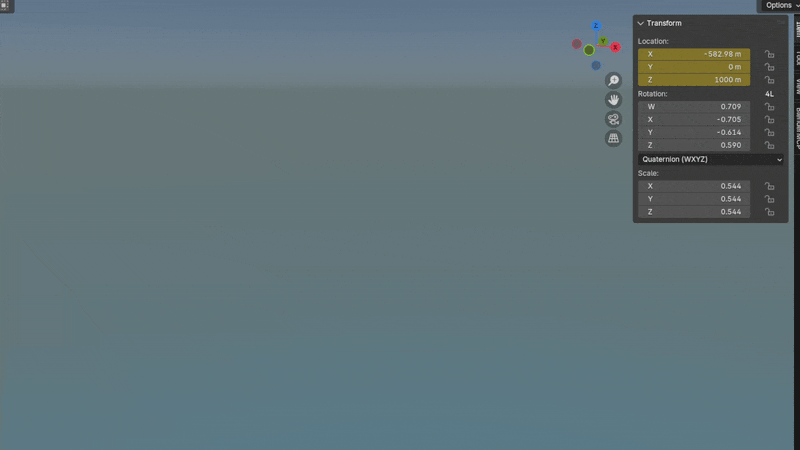
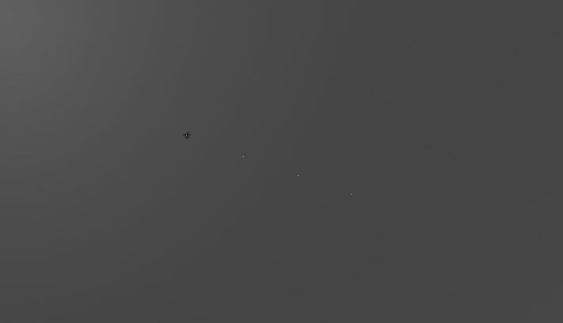
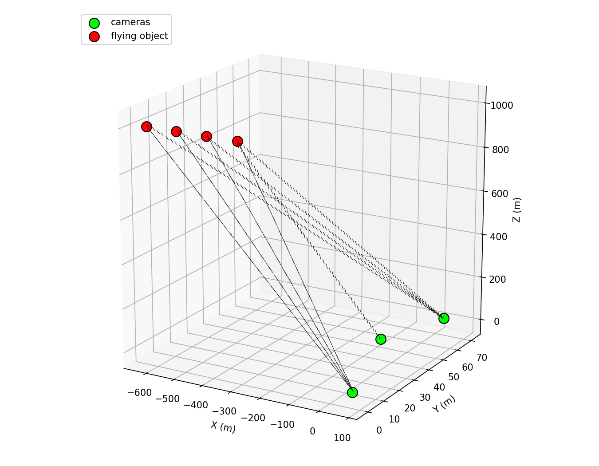

# Raydar

A C++ project for detecting and tracking objects in 3D space using multiple 2D cameras. The program outputs a list of 3D coordinates representing the tracked object's position over time.

## How it works

Each camera compares consecutive frames to find pixels that changed. For every moving pixel, a ray is projected from the camera through the scene using its intrinsic and extrinsic parameters. All rays are cast into a shared sparse voxel grid, and voxels hit by rays from multiple cameras simultaneously are considered detections. The centroid of those intersecting voxels gives the object's 3D position for that frame, which is then written to `detected_objects.txt`.

This means a moving object only seen by a single camera is not detected. One ray defines a line in space, not a point. Multiple cameras are required to triangulate a position, so objects too close to one camera and out of view of all others are not detected.

## Demo

The demo below uses synthetic data generated in Blender. A plane flies through a 3D scene while multiple virtual cameras capture its movement. These camera frames are then fed into Raydar, which detects the object in each view and triangulates its position to compute 3D coordinates over time.

### Animation (Blender)


### Tracked Flight Path


The green pixels show motion detected by one camera, based on color changes between consecutive frames. Neighboring changed pixels are grouped into a single object.

### Voxel Projection


Each camera projects rays toward the moving pixels it sees. Where rays from different cameras meet, the voxel grid lights up, and that intersection is the object. Cameras are green, the detected positions red, and together they trace the flight path. This test setup uses 3 cameras. One camera only sees the plane in a single frame, contributing only one voxel intersection. The minimum intersection threshold is set to 2, a voxel must be hit by rays from at least 2 cameras to count as a detection. Using more cameras and raising this threshold reduces false positives.

The detected coordinates for this set-up are:

| Detected | Nearest simulation position |
|---|---|
| (−628, 1, 1001) | Frame 0: (−625, 0, 1000) |
| (−523, 1, 1003) | Frame 0: (−625, 0, 1000) |
| (−413, 1, 994) | Frame 1: (−373, 0, 1000) |
| (−306, 0, 987) | Frame 1: (−373, 0, 1000) |

Each voxel is 1×1×1 m, so the positional precision is bounded by the grid resolution. Y is within 1 unit, consistent with rounding to the nearest voxel center. Height (Z) varies more than Y because all cameras are positioned at ground level and look steeply upward toward the plane at Z=1000. The rays arrive at nearly parallel angles in Z, so their intersection point in height is less well defined than in the lateral axes. X varies most because the voxel centroid lands somewhere along the plane's travel path between two frames (~252 units per frame) rather than at an exact snapshot position.

Detection 1 appears twice because motion detection compares consecutive frames and picks up both regions where pixels changed: where the plane was in frame 0 (pixels switching from plane to background) and where it arrived in frame 1 (pixels switching from background to plane). Both regions produce separate ray intersections and therefore two distinct 3D positions.

## Quick Start

### Prerequisites

- C++ compiler (GCC/Clang)
- GNU Make
- wget or curl (for dependency installation)

## ⚠️ Cloning the Repository

### Large Files (Blender Scenes)

This project includes large `.blend` files (e.g., 3D scene with 5 cameras and a plane) which are tracked using [Git LFS (Large File Storage)](https://git-lfs.github.com/).

Before cloning the repository, make sure Git LFS is installed:

```bash
# One-time setup
git lfs install

# Clone the repository
git clone https://github.com/luisluis8414/raydar.git
```

If you've already cloned without LFS, run:

```bash
git lfs pull
```

**Note:** Blender backup files such as `.blend1` and `.blend@` are excluded via `.gitignore`. Only the primary `.blend` files are tracked.

### Setup

1. Install Premake5:

```bash
# Install premake into bin/
./scripts/install_premake5.sh
```

2. Install dependencies:

```bash
# Install dependencies into deps
scripts/dependencies/install_all.sh
```

### Build and Run

You can use the run script to build and run the project:

```bash
# Build and run Debug version
./scripts/build_and_run.sh Debug

# Build and run Release version
./scripts/build_and_run.sh Release
```

Alternatively, you can build and run manually:

1. Generate build files:

```bash
# You can replace 'gmake2' with any other Premake action (e.g., vs2022, xcode4)
./bin/premake5 gmake2
```

2. Compile:

```bash
# Debug build
make config=debug

# Release build
make config=release
```

3. Run:

```bash
# Debug version
./bin/Debug/Playground

# Release version
./bin/Release/Playground
```

## Project Structure

```
.
├── raydar/              # Core library
│   ├── include/         # Public headers
│   └── src/             # Implementation
├── Playground/          # Example application
├── blender/             # Blender scenes and Python scripts
│   ├── *.blend          # 3D scene files (Plane flying, mosquito demos)
│   └── *.py             # Camera capture scripts
├── data/                # Sample datasets
│   ├── plane/            # plane tracking data
│   └── moths/           # Moth tracking data
├── assets/              # Images, videos, and GIFs
├── docs/                # Documentation
│   └── metadata_format.md
├── deps/                # External dependencies (auto-installed)
└── scripts/             # Build and setup scripts
```

## Dependencies

- [Eigen](https://eigen.tuxfamily.org/) - Linear algebra library
- [nlohmann/json](https://github.com/nlohmann/json) - JSON for Modern C++
- [stb_image](https://github.com/nothings/stb) - Image loading (header-only, used for reading images)
- [stb_image_write](https://github.com/nothings/stb) - Image writing (header-only, used for saving visualizations)

## Documentation

- [Metadata File Format](docs/metadata_format.md) - Specification for camera metadata JSON files

## Code Structure

- `movement_detection.hpp/cpp`: Core motion detection algorithms
- `vector_ops.hpp/cpp`: Vector math and ray calculation helpers
- `visualization.hpp/cpp`: Visualization tools for motion detection output
- `logger.hpp/cpp`: Logging utilities
